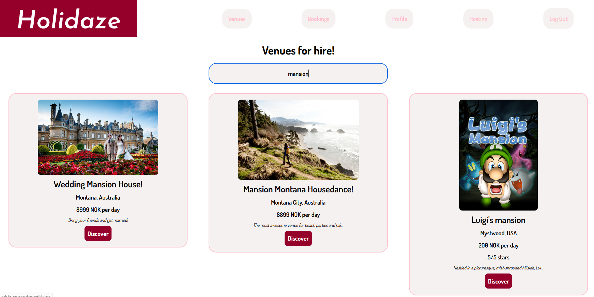

# Project Exam 2
Johan Lossius Project Exam 2 for Frontend & UX Noroff.



## Shout out to Noroff
Before going into the details of how to get started, I'd like to thank Noroff for helping me throughout these 4 years with the studies.
It has been a great experience for me, even though it has been digital and with limited live interaction.
Hugely appreciated!

## Getting started with the development:
- Clone the repo from GitHub via GitHub Desktop:
clone https://github.com/JohanLossius/holidaze.git
If you are using GitHub Desktop and Visual Studio Code editor, simply launch and install it via GitHub Desktop by pulling it from the GitHub repo and follow the instructions of the program until you're setup in Visual Studio Code.

OR

- You can also pull it directly into VS code from GitHub by adding:
```
git remote add origin https://github.com/JohanLossius/holidaze.git
git pull origin main
```

- And then install it. Run:
```
npm i
```

## Technologies & styling
This project was built with
- React v18.3.1
- Tailwind v3.4.16
- Vite v6.0.1
and some other technologies & dependencies that can be seen in the package.json file.

Tailwind is used mostly out of the box, only with a few custom configs in the tailwind.config.js file.
Some custom css is used to be able to target the booking calendar installed with npm.

## Concept of Holidaze
- Holidaze was built for being fun, creative and creating good vibes and memories.
This should be kept in mind for when continuing to develop it, to maintain the good vibes of amazing experiences.
- Holidaze was originally intended to be a site for short term rental of venues, such as sporting, cultural and business venues such as for conferences etc. However, seeing that the API documentation and the general theme was greatly inspired by the Airbnb concept, I decided to make it similar to that concept to avoid building non-existent functionality on the frontend.
- So the concept of Holidaze is to provide high quality venues that are curated so that the clients can be confident that their experiences are top notch. We want our brand to be associated with fun, blissful experiences for families and people, old as well as young, where customer delight is at the center of the entire experience. From first discovering the web site, to booking a stay, meeting the host, and all the way to packing your stuff and leaving your venue, hopefully providing a great review of the stay & host.
- From this concept it can be continued to be developed, as long as one uses the end customer's delight or lack thereof as the guiding north star for what is "right" and "wrong" in terms of the product development, features and new functionality.

## Getting Started with React & Vite
Some instructions for setting up with React and Vite here:
This template provides a minimal setup to get React working in Vite with HMR and some ESLint rules.
Currently, two official plugins are available:
- [@vitejs/plugin-react](https://github.com/vitejs/vite-plugin-react/blob/main/packages/plugin-react/README.md) uses [Babel](https://babeljs.io/) for Fast Refresh
- [@vitejs/plugin-react-swc](https://github.com/vitejs/vite-plugin-react-swc) uses [SWC](https://swc.rs/) for Fast Refresh

## Available Scripts

In the project directory, you can run:

### `npm run dev`

Runs the app in the development mode.
Open [http://localhost:5173/](http://localhost:5173/) to view it in your browser.
(Or whatever local host URL that it runs on for your setup.)

The page will reload when you make changes.
Please note:

I had to use the following in my vite.config.js file to make ensure vite picked up changes with HMR:
```
server: {
  watch: {
    usePolling: true, // Enables polling to pick up file changes
    interval: 100,    // Polling interval in milliseconds
  },
},
```

### `npm run build`

Builds the app for production to the `dist` folder.
It correctly bundles React in production mode and optimizes the build for the best performance.

## Contributing
For making technical contributions to Holidaze you are well off by focusing on the best practices of modern frontend development and UX/UI design.
Write code that is logical in its syntax, and well structured so that it makes sense and provides clarity, simply by reading it.
Also ensure simple documentation throughout when purposeful, but not just for the sake of doing it.
For making sure new design and functionality are in line with the business purpose of Holidaze, please see the section above "Concept of Holidaze".

## License
No licenses in particular for this repo, but please credit me if you decide to use any of the design I've created.

## Acknowledgments
I've asked for help from instructors occasionally when I've had questions or challenges to deal with, so thanks a lot to those concerned.
